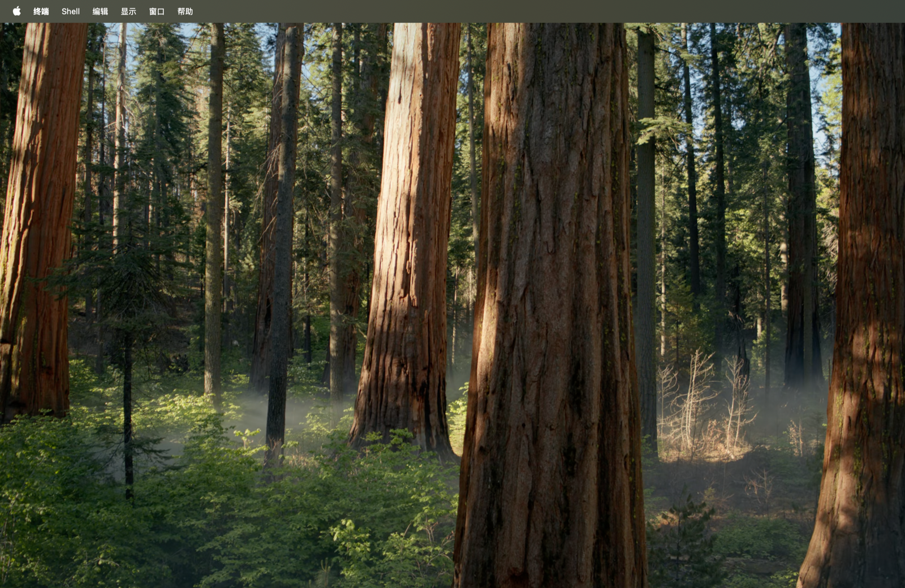
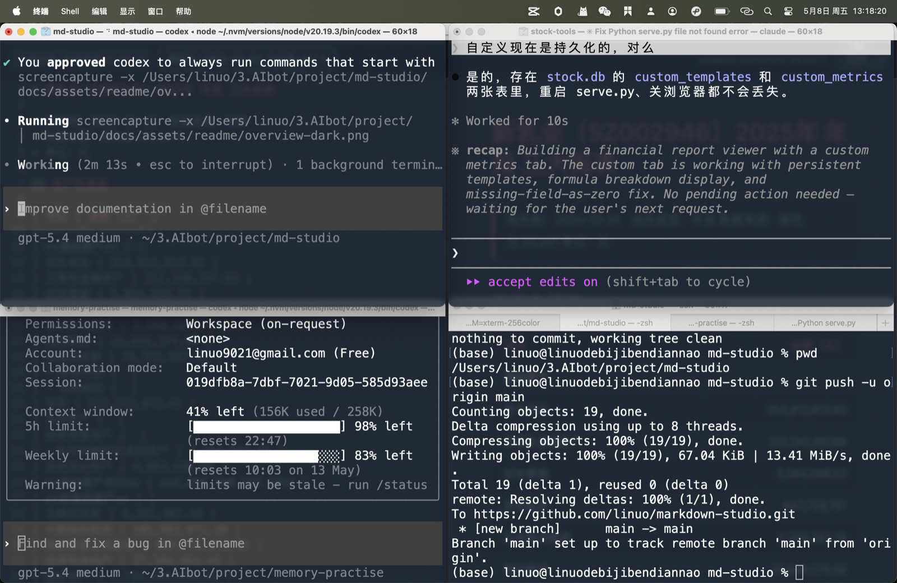

# MD Studio

[中文](./README.md)

MD Studio is a desktop-oriented Markdown editor with live preview, multi-tab editing, native file workflows, external file change sync, and a keyboard-first experience.

## Screenshots

### Light Theme



### Dark Theme



## Features

- Live split preview: edit on the left, render on the right
- Desktop file workflow: open, save, save as, and file association
- Multi-tab editing for multiple Markdown files
- External file sync with auto-refresh or overwrite confirmation
- Light and dark themes
- Tab rename by double-clicking the tab title

## Run

### Install dependencies

```bash
npm install
```

### Start the desktop app

```bash
npm run desktop
```

### Build an installer

```bash
npm run dist
```

## Shortcuts

| Shortcut | Action |
| --- | --- |
| `Cmd+O` | Open a Markdown file |
| `Cmd+T` | Create a new empty tab |
| `Cmd+S` | Save the current tab |
| `Shift+Cmd+S` | Save the current tab as |
| `Cmd+W` | Close the current tab; close the window if it is the last tab |
| `Cmd+Option+Left` | Focus the tab on the left |
| `Cmd+Option+Right` | Focus the tab on the right |
| `Cmd+1` to `Cmd+9` | Jump to a tab by position |
| `Enter` | Confirm tab rename |
| `Esc` | Cancel tab rename |

## File Behavior

- When the current tab has no unsaved edits:
  MD Studio auto-refreshes when the same file changes on disk.
- When the current tab has unsaved edits:
  MD Studio asks before replacing the in-editor content with the disk version.
- For packaged desktop builds:
  the app can register itself as the default editor for `.md` and `.markdown`.

## Project Structure

```text
src/          React UI and editor logic
electron/     Electron main process and preload bridge
docs/assets/  README screenshot assets
```

## Stack

- React 18
- Vite
- TypeScript
- Electron
- CodeMirror 6
- markdown-it
- highlight.js
